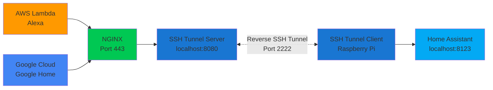

# SSH Reverse Tunnel for Home Assistant

Reverse SSH tunnel to expose Home Assistant (behind NAT) to cloud services like AWS Lambda (Alexa) and Google Cloud (Google Home).

## Features

- ED25519 SSH keys (RSA-4096 fallback)
- Podman/Docker containers with Alpine 3.21
- NGINX reverse proxy with IP whitelisting
- systemd and Quadlet deployment options
- Multi-arch: amd64, arm64

## Architecture



**Flow:**
1. Cloud services (AWS Lambda/Google Cloud) → NGINX reverse proxy
2. NGINX → SSH tunnel server (localhost:8080 only)
3. SSH tunnel → Encrypted connection to client
4. Client → Local Home Assistant instance

## Components

### Server (Public VPS)
- SSH server container (Alpine 3.21)
- Accepts reverse tunnel on port 2222
- Forwards to Home Assistant via localhost:8080
- NGINX reverse proxy with cloud IP whitelist
- systemd service

### Client (Raspberry Pi)
- SSH client container (Alpine 3.21)
- Auto-reconnect with autossh
- Forwards local Home Assistant (port 8123)
- **Podman Quadlet** (Podman 5.x)
- firewalld protection

## Quick Start

### Prerequisites
- **Server**: Podman 4.9.4+, NGINX
- **Client**: Podman 5.x
- SSH keys (ED25519 preferred)

See **[DEPLOY.md](DEPLOY.md)** for complete setup.

## Configuration

### Environment Variables

**Server** (`/etc/ssh-tunnel/server.env`):
```bash
TZ=UTC
SSH_PORT=2222
FORWARDED_PORT=8080
```

**Client** (`/etc/ssh-tunnel/client.env`):
```bash
SERVER_HOST=your-server.example.com
SERVER_PORT=2222
SERVER_USER=tunnel
LOCAL_HOMEASSISTANT_HOST=host.containers.internal
LOCAL_HOMEASSISTANT_PORT=8123
REMOTE_PORT=8080
```

## Monitoring

**Server logs**:
```bash
sudo journalctl -u ssh-tunnel-server -f
sudo podman logs -f ssh-tunnel-server
```

**Client logs**:
```bash
sudo journalctl -u ssh-tunnel-client -f
sudo podman logs -f ssh-tunnel-client
```

**NGINX logs**:
```bash
sudo tail -f /var/log/nginx/homeassistant_access.log
```

## Security

**SSH**
- ED25519 keys (RSA-4096 fallback)
- Public key authentication only
- Strong ciphers: chacha20-poly1305, aes-gcm

**Containers**
- Read-only key mounts
- Minimal capabilities
- tmpfs with security options

**Network**
- NGINX IP whitelisting (AWS + Google Cloud ranges)
- Rate limiting
- firewalld on client

## Documentation

- **[DEPLOY.md](DEPLOY.md)** - Deployment guide
- **[SECURITY.md](SECURITY.md)** - Security notes
- **[examples/nginx/](examples/nginx/)** - NGINX configuration

## Development

### Building Images

```bash
# Server
cd server
podman build -t ssh-tunnel-server:latest .

# Client
cd client
podman build -t ssh-tunnel-client:latest .
```

### GitHub Actions

Container images are automatically built and published to GitHub Container Registry on:
- Push to `main` branch
- Tags matching `v*` (releases)
- Manual workflow dispatch

Pull images:
```bash
podman pull ghcr.io/mafn/sshtunnel/server:latest
podman pull ghcr.io/mafn/sshtunnel/client:latest
```

## License

See [LICENSE](LICENSE) file.

